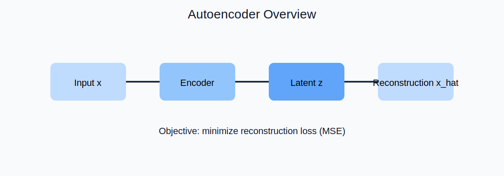

# LFW Face Generation and Latent Editing

This project implements an end-to-end pipeline for **face reconstruction** and **semantic latent editing** on the Labeled Faces in the Wild (LFW) dataset.

Main notebook:
- `lfw-face-generation-latent-editing.ipynb`

Dataset:
- https://www.kaggle.com/datasets/jessicali9530/lfw-dataset

---

## Project Goal

I built this notebook to answer three core questions:

1. Can a dense autoencoder learn compact identity-aware facial representations from LFW?
2. Can latent-space arithmetic produce interpretable edits such as smiles and sunglasses?
3. Can I explain model behavior with transparent diagnostics (error maps, SSIM, latent projections)?

---

## Concept Diagrams

### 1. Autoencoder intuition



### 2. Autoencoder vs Variational Autoencoder


### 3. Architecture and objective summary used in this notebook


---

## End-to-End Workflow (Detailed)

```mermaid
flowchart TD
    A[Define Objective\nFace reconstruction + latent editing] --> B[Load LFW dataset\nImages + metadata]
    B --> C[Data Discovery\nIdentity frequency + random sample audit]
    C --> D[Attribute Alignment\nMerge image paths with attributes]
    D --> E[Preprocessing\nCrop -> Resize 45x45 -> Normalize]
    E --> F[Train/Validation Split\nPrepare tensors for modeling]

    F --> G[Dense Autoencoder Model\nEncoder 6075-1500-1000-100\nDecoder 100-1000-1500-6075]
    G --> H[Training Protocol\nMSE + Adam(lr=0.001)\n50 epochs, batch size 64]

    H --> I[Learning Diagnostics\nTrain/Val loss curves\nGeneralization behavior]
    I --> J[Reconstruction Analysis\nOriginal vs reconstructed\nError maps + SSIM]
    J --> K[Latent Sampling\nGenerate faces from random z]

    K --> L[Attribute Buckets\nSmile / No-smile / Glasses subsets]
    L --> M[Latent Vector Arithmetic\nConstruct semantic directions]
    M --> N[Apply Edits\nSmile and sunglasses transformations]

    N --> O[Latent Interpretability\nInterpolation + PCA + t-SNE]
    O --> P[Direction Validation\nClassifier-derived direction\nvs mean-difference direction]
    P --> Q[Final Conclusions\nBehavior, limits, and next steps]
```

---

## What I Implemented

### Data and preprocessing
- Kaggle path-based loading of LFW images.
- Identity-frequency EDA to inspect class imbalance.
- Attribute-aligned image pipeline.
- Face-region crop and resize to `45 x 45`.
- Normalization to `[0, 1]` and train/validation split.

### Model and training
- Dense autoencoder with latent dimension `100`.
- Symmetric encoder-decoder design.
- Training objective: **MSE reconstruction loss**.
- Optimizer: **Adam (lr=0.001)**.
- Training schedule: **50 epochs**, **batch size 64**.

### Evaluation and analysis
- Reconstruction side-by-side visualization.
- Pixel-level error maps.
- SSIM score reporting (if `scikit-image` available).
- Random latent sampling for synthetic face generation.

### Latent editing and interpretation
- Built attribute subsets (smiling/non-smiling/eyeglasses/sunglasses).
- Computed latent directions by vector differences.
- Applied controllable edits by moving samples in latent space.
- Added latent interpolation to verify manifold continuity.
- Added PCA/t-SNE for latent-space structure analysis.
- Compared mean-difference edit direction with classifier-derived direction.

---

## File Structure

- `lfw-face-generation-latent-editing.ipynb` : Main implementation notebook
- `README.md` : Project explanation and workflow
- `Autoencoder.svg` : Autoencoder concept figure
- `VAE_vs_AE.svg` : AE vs VAE comparison figure
- `Dense_AE_Architecture.svg` : Model and objective figure

---

## Notes

- The notebook is structured for Kaggle execution.
- SVG images are embedded directly in markdown sections.
- SSIM outputs appear only if `skimage` is installed.

---

## Possible Extensions

1. Replace dense AE with convolutional AE or VAE and compare latent smoothness.
2. Add identity-preservation metrics (embedding similarity) for edit quality.
3. Introduce disentanglement constraints for cleaner attribute control.
4. Add threshold calibration on a dedicated validation split.
