# LFW Face Generation and Latent Attribute Editing

Main notebook:
- `lfw-face-generation-latent-editing.ipynb`

---

## Notebook Flow (Mermaid)


---

## Dataset Introduction

This project uses the **Labeled Faces in the Wild (LFW)** dataset:
- Dataset link: https://www.kaggle.com/datasets/jessicali9530/lfw-dataset
- Data used in notebook:
  - RGB face images
  - Face-level attributes (smiling, eyeglasses, sunglasses)

The notebook aligns image files with attribute rows, crops/resizes faces to `45x45`, normalizes pixel values, and prepares train/validation splits.

---

## What We Are Doing Here

The goal is to learn a latent representation of faces that supports:

- Faithful reconstruction  
- Realistic sampling / generation  
- Controllable semantic edits (smile, sunglasses)  

The final training path in this notebook is **VAE-focused**, because it gives a smoother and more structured latent space for generation and editing.

---

# Variational Autoencoder Architecture (Implemented Model)

Below is the exact architecture used in the notebook.

### Model Summary

- Input Dimension: `45 x 45 x 3 = 6075`
- Encoder:
  - Linear(6075 → 1500)
  - BatchNorm1d(1500)
  - ReLU
  - Linear(1500 → 1000)
  - BatchNorm1d(1000)
  - ReLU
- Latent:
  - `mu = Linear(1000 → dim_z)`
  - `logvar = Linear(1000 → dim_z)`
- Decoder:
  - Linear(dim_z → 1000)
  - BatchNorm1d(1000)
  - ReLU
  - Linear(1000 → 1500)
  - BatchNorm1d(1500)
  - ReLU
  - Linear(1500 → 6075)
  - Sigmoid

---

## VAE Architecture Diagram (Matches PyTorch Code)

```mermaid
flowchart LR

  X["Input 6075"]

  X --> E1["Linear 1500"]
  E1 --> BN1["BatchNorm 1500"]
  BN1 --> R1["ReLU"]

  R1 --> E2["Linear 1000"]
  E2 --> BN2["BatchNorm 1000"]
  BN2 --> R2["ReLU"]

  R2 --> MU["Linear to mu"]
  R2 --> LV["Linear to logvar"]

  MU --> Z["Reparameterization"]
  LV --> Z

  Z --> D1["Linear 1000"]
  D1 --> BN3["BatchNorm 1000"]
  BN3 --> R3["ReLU"]

  R3 --> D2["Linear 1500"]
  D2 --> BN4["BatchNorm 1500"]
  BN4 --> R4["ReLU"]

  R4 --> OUT["Linear 6075"]
  OUT --> SIG["Sigmoid Output"]
```



This diagram corresponds exactly to:

```python
class VAE(nn.Module):
    def __init__(self):
        super().__init__()
        self.encoder = nn.Sequential(
            nn.Linear(INPUT_DIM, 1500),
            nn.BatchNorm1d(1500),
            nn.ReLU(),
            nn.Linear(1500, 1000),
            nn.BatchNorm1d(1000),
            nn.ReLU(),
        )
        self.fc_mu = nn.Linear(1000, dim_z)
        self.fc_logvar = nn.Linear(1000, dim_z)

        self.decoder = nn.Sequential(
            nn.Linear(dim_z, 1000),
            nn.BatchNorm1d(1000),
            nn.ReLU(),
            nn.Linear(1000, 1500),
            nn.BatchNorm1d(1500),
            nn.ReLU(),
            nn.Linear(1500, INPUT_DIM),
            nn.Sigmoid(),
        )
```

---

## Autoencoder (AE) Diagram


Autoencoders compress an input image into a latent vector and decode it back to reconstruct the same image.

Why AE matters in this project:
- It defines the core encoder-decoder idea.
- It is the conceptual baseline before moving to probabilistic latent modeling.

---

## AE vs VAE


### Key Differences

**AE**
- Deterministic latent vector  
- Reconstruction-only objective  

**VAE**
- Latent distribution (`mu`, `logvar`)  
- Reparameterization trick  
- Reconstruction loss + KL divergence  
- Smooth latent space for interpolation and generation  

---

## How Each Flow Step Is Implemented

### 1. Load + Preprocess
- Read LFW and attributes
- Align rows
- Resize to `45x45`
- Normalize

### 2. Train/Val Split
- Create train and validation tensors

### 3. VAE Training
- Optimize reconstruction + KL divergence

### 4. Reconstruction Diagnostics
- Compare originals vs reconstructions
- Inspect error maps and SSIM

### 5. Random Generation
- Sample latent vectors from prior
- Decode to synthetic faces

### 6. Interpolation
- Interpolate between two latent points
- Decode intermediate steps

### 7. Latent Analysis
- PCA / t-SNE on latent embeddings

### 8. Attribute Editing
- Compute smile / sunglasses directions
- Apply latent vector arithmetic

---

## Included Files

- `lfw-face-generation-latent-editing.ipynb`
- `AE_vs_VAE_Explained.svg`
- `AES.svg`
- `README.md`
