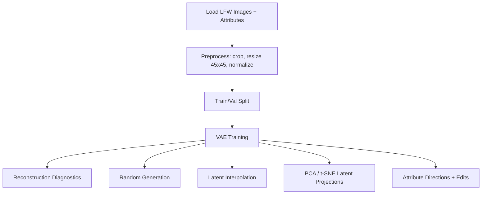
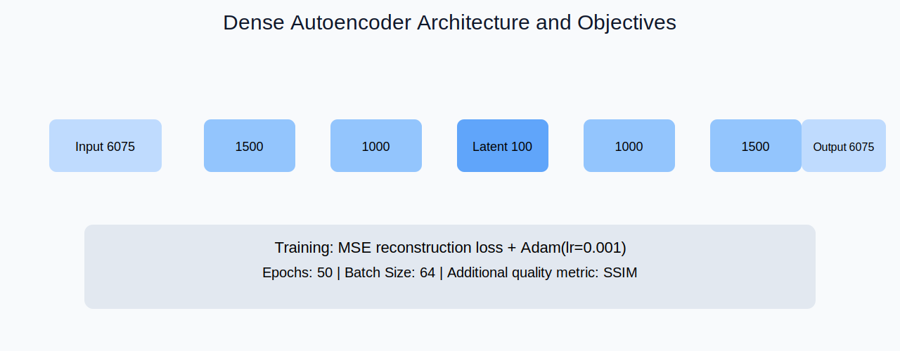
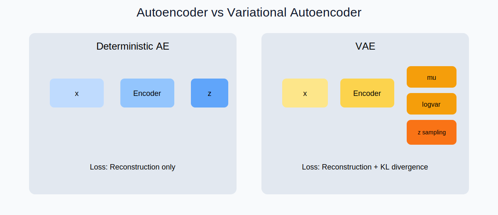

# LFW Face Generation and Latent Attribute Editing

Main notebook:
- `lfw-face-generation-latent-editing.ipynb`

Dataset:
- https://www.kaggle.com/datasets/jessicali9530/lfw-dataset

## Why AE and VAE

Autoencoders (AE) are great for learning compact representations that reconstruct inputs well. Variational Autoencoders (VAE) add a probabilistic latent space (`mu`, `logvar`) and a KL regularization term that encourages smooth, structured sampling. For this project, the VAE is used in training because it supports more reliable generation and smoother latent edits while still preserving reconstruction quality.

Key differences:
- **AE**: deterministic latent code, optimized only for reconstruction.
- **VAE**: stochastic latent code, optimized for reconstruction + KL divergence to a prior, enabling better sampling and interpolation.

## Workflow

1. Data discovery and preprocessing (LFW images + attributes).
2. Train a VAE on 45x45 RGB faces (latent dim = 100).
3. Evaluate reconstructions and generation quality.
4. Analyze the latent space (PCA, t-SNE, interpolation).
5. Attribute edits (smile, sunglasses) by latent vector arithmetic.

## Notebook Flow (Mermaid)



## VAE Architecture Used

- Input: `45 x 45 x 3 = 6075`
- Encoder: `6075 -> 1500 -> 1000`
- Latent: `mu, logvar -> 100`
- Decoder: `100 -> 1000 -> 1500 -> 6075` (Sigmoid output)

```mermaid
flowchart LR
  X[Input 6075] --> E1[Linear 1500]
  E1 --> E2[Linear 1000]
  E2 --> MU[mu (100)]
  E2 --> LV[logvar (100)]
  MU --> Z[Reparameterize z]
  LV --> Z
  Z --> D1[Linear 1000]
  D1 --> D2[Linear 1500]
  D2 --> O[Output 6075]
```

## SVG Diagrams







## Included Files

- `lfw-face-generation-latent-editing.ipynb`
- `Autoencoder.svg`
- `Dense_AE_Architecture.svg`
- `AE_vs_VAE_Explained.svg`
- `AE.svg`
- `AES.svg`
- `AutoEncoders.svg`
- `VAE_vs_AE.svg`
- `README.md`

