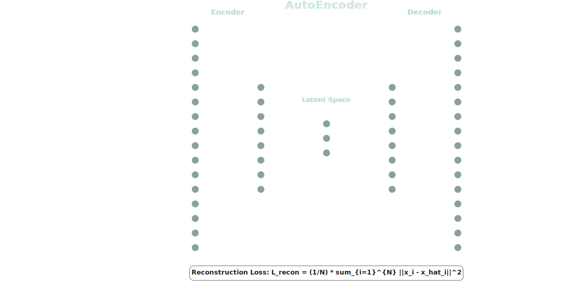
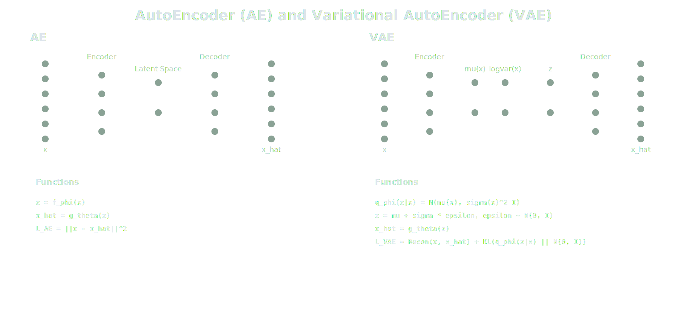
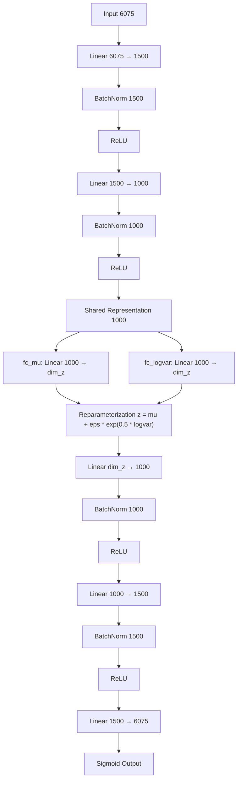
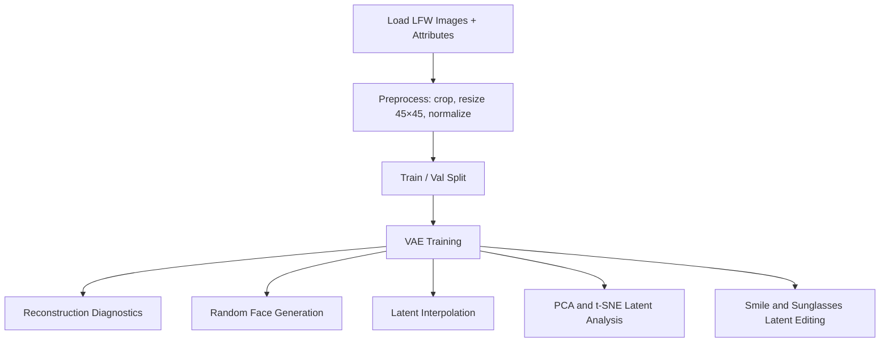

# LFW Face Generation and Latent Attribute Editing

Main notebook: `lfw-face-generation-latent-editing.ipynb`

---

## Dataset

This project uses the **Labeled Faces in the Wild (LFW)** dataset ([Kaggle link](https://www.kaggle.com/datasets/jessicali9530/lfw-dataset)).

Data used:
- RGB face images
- Face-level attributes: smiling, eyeglasses, sunglasses

Images are aligned with attribute rows, cropped/resized to `45×45`, normalized, and split into train/validation sets.

---

## Goal

Learn a latent representation of faces that supports:

- Faithful reconstruction
- Realistic sampling and generation
- Controllable semantic edits (smile, sunglasses)

The final training path uses a **VAE**, which yields a smoother and more structured latent space than a plain autoencoder.

---

## Autoencoder (AE)



An autoencoder compresses an input image into a latent vector, then decodes it back to reconstruct the original. It defines the core encoder-decoder concept and serves as the conceptual baseline before probabilistic latent modeling.

**AE properties:**
- Deterministic latent vector
- Reconstruction-only objective

---

## AE vs VAE



**VAE adds:**
- Latent distribution (`mu`, `logvar`) instead of a single point
- Reparameterization trick for backpropagation through sampling
- Reconstruction loss + KL divergence
- Smooth, continuous latent space that supports interpolation and generation

---

## VAE Architecture

- **Input:** `45 × 45 × 3 = 6075`
- **Latent dimension:** `dim_z` (configurable)

### Architecture Diagram



### Model Code

```python
import torch
import torch.nn as nn

INPUT_DIM = 45 * 45 * 3  # 6075
dim_z = 128              # latent dimension — tune as needed


class VAE(nn.Module):
    def __init__(self):
        super().__init__()

        self.encoder = nn.Sequential(
            nn.Linear(INPUT_DIM, 1500),
            nn.BatchNorm1d(1500),
            nn.ReLU(),
            nn.Linear(1500, 1000),
            nn.BatchNorm1d(1000),
            nn.ReLU(),
        )

        self.fc_mu     = nn.Linear(1000, dim_z)
        self.fc_logvar = nn.Linear(1000, dim_z)

        self.decoder = nn.Sequential(
            nn.Linear(dim_z, 1000),
            nn.BatchNorm1d(1000),
            nn.ReLU(),
            nn.Linear(1000, 1500),
            nn.BatchNorm1d(1500),
            nn.ReLU(),
            nn.Linear(1500, INPUT_DIM),
            nn.Sigmoid(),
        )

    def encode(self, x):
        h = self.encoder(x)
        return self.fc_mu(h), self.fc_logvar(h)

    def reparameterize(self, mu, logvar):
        std = torch.exp(0.5 * logvar)
        eps = torch.randn_like(std)
        return mu + eps * std

    def decode(self, z):
        return self.decoder(z)

    def forward(self, x):
        mu, logvar = self.encode(x)
        z = self.reparameterize(mu, logvar)
        recon = self.decode(z)
        return recon, mu, logvar


def vae_loss(recon_x, x, mu, logvar, beta=1.0):
    """ELBO loss: reconstruction (BCE) + KL divergence."""
    recon_loss = nn.functional.binary_cross_entropy(recon_x, x, reduction="sum")
    kl_loss    = -0.5 * torch.sum(1 + logvar - mu.pow(2) - logvar.exp())
    return recon_loss + beta * kl_loss
```

---

## Notebook Flow



### Step-by-Step

1. **Load + Preprocess** — Read LFW images and attributes, align rows, resize to `45×45`, normalize to `[0, 1]`
2. **Train / Val Split** — Create train and validation tensors
3. **VAE Training** — Optimise ELBO (reconstruction + KL divergence)
4. **Reconstruction Diagnostics** — Compare originals vs reconstructions; inspect error maps and SSIM
5. **Random Generation** — Sample latent vectors from the prior `N(0, I)` and decode to synthetic faces
6. **Interpolation** — Interpolate between two latent points and decode intermediate steps
7. **Latent Analysis** — PCA / t-SNE on latent embeddings coloured by attributes
8. **Attribute Editing** — Compute smile / sunglasses directions via latent vector arithmetic and apply them

---

## Included Files

| File | Description |
|------|-------------|
| `lfw-face-generation-latent-editing.ipynb` | Main notebook |
| `AES.svg` | Autoencoder diagram |
| `AE_vs_VAE_Explained.svg` | AE vs VAE comparison diagram |
| `README.md` | This file |
